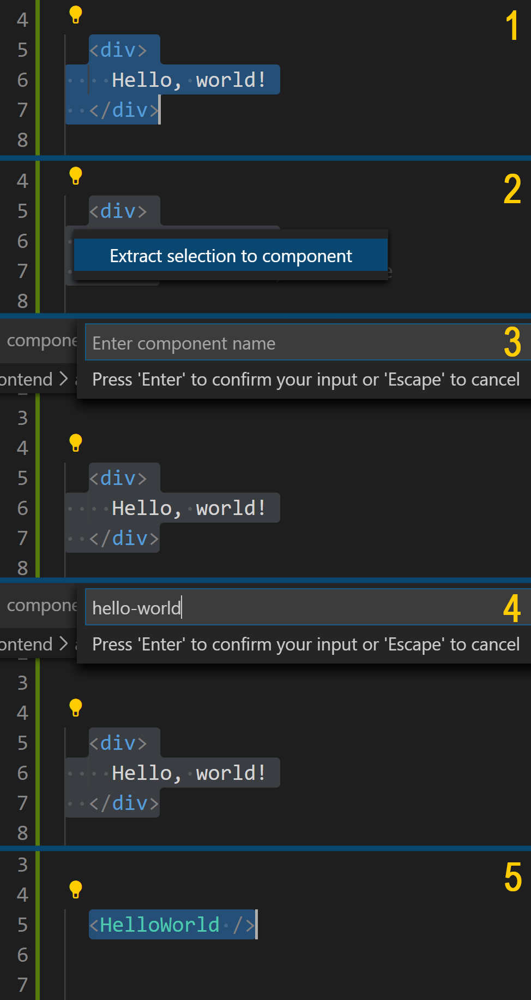

# els-component-extraction-addon
Ember Language Server Templates Code Actions extension

How to use?

Install this addon as `dev-dependency` inside your ember project.

### Features

* component creation from user selection

### NPM
`npm install els-component-extraction-addon --save-dev`

### Yarn
`yarn add els-component-extraction-addon --dev`

### VSCode

Install: [Unstable Ember Language Server](https://marketplace.visualstudio.com/items?itemName=lifeart.vscode-ember-unstable).
Install: [ember-fast-cli addon](https://github.com/lifeart/ember-fast-cli)

* Restart `VSCode`.
* Start project server

## Usage 

Select text, click on code action icon, select `Extract selection to component`.

